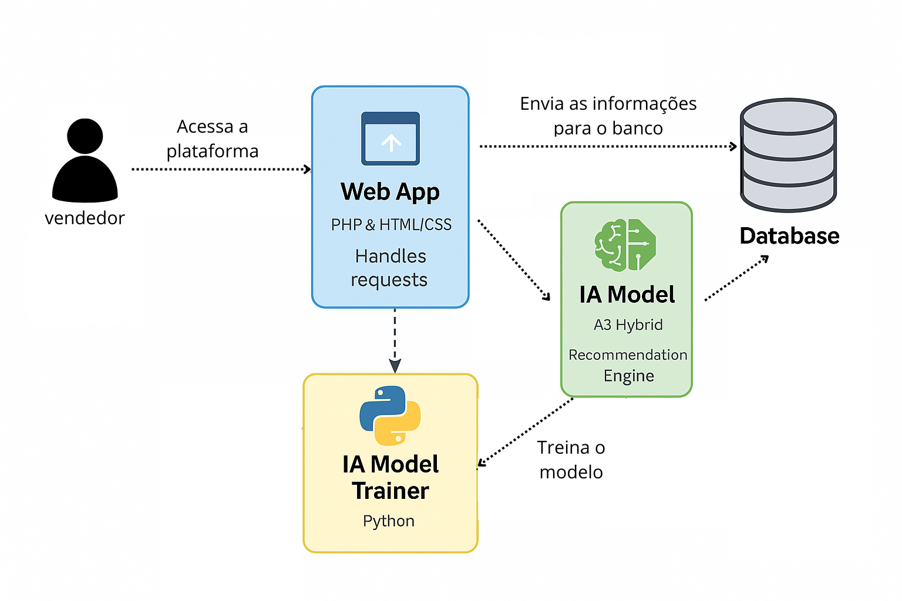

# 🧠 Sistema de Vendas com Recomendação Inteligente  

Projeto desenvolvido em PHP utilizando o Adianti Framework, Python e MySQL, contendo um sistema completo de gerenciamento de vendas integrado a um modelo de **Inteligência Artificial** capaz de recomendar produtos para cada cliente.  

## 📌 Funcionalidades  

- Cadastro e consulta de clientes  
- Registro de vendas com múltiplos itens  
- Geração de relatórios e gráficos  
- Modelo de IA para recomendações  
- Interface limpa e navegável  

## 🛠️ Stack Tecnológica  

### Frontend:  
- HTML5 + CSS3 + Bootstrap (Adianti)  

### Backend:  
- PHP 8.2 (Adianti)  

### Banco de Dados:  
- MySQL/MariaDB  

### IA:  
- Python 3.12  

## Requisitos Funcionais    
● RF01: O sistema deve permitir o cadastro de clientes.  
● RF02: O sistema deve permitir o registro de vendas.  
● RF03: O sistema deve gerar relatórios e gráficos das vendas  
● RF04: O sistema deve fornecer recomendações de produtos aos vendedores com base no histórico de compras individual de cada cliente, utilizando **Inteligência Artificial**.  

## Casos de uso  
● UC01 – Cadastrar Cliente  
Ator: Vendedor  
Descrição: O vendedor registra um novo cliente no sistema, preenchendo nome, CPF, cidade e estado.  
Fluxo principal:  
- Vendedor acessa a tela “Cadastro de Cliente”  
- Preenche os dados obrigatórios  
- Salva o registro  
- Sistema valida e armazena no banco de dados  

● UC02 – Registrar Venda  
Ator: Vendedor  
Descrição: O vendedor registra uma venda contendo um cliente e uma lista de produtos.  
Fluxo principal:  
- Informa o cliente  
- Seleciona um ou mais produtos  
- Finaliza a venda  
- Sistema atualiza o histórico e calcula o total  

● UC03 – Consultar Histórico de Vendas  
Ator: Vendedor  
Descrição: Permite visualizar todas as vendas registradas, filtrando por data ou cliente.  

● UC04 – Visualizar Relatórios e Gráficos  
Ator: Vendedor  
Descrição: Exibe gráficos e relatórios gerados automaticamente com base nas vendas do sistema.  

● UC05 – Visualizar Recomendações  
Ator: Vendedor  
Descrição: Para um cliente específico, o sistema exibe recomendações de produtos com base na IA.  

## 🗂️ Arquitetura (C4)  

  

## 🧠 Arquitetura da IA

A IA utiliza um modelo não supervisionado baseado em:  

- Co-ocorrência de produtos  
- Similaridade **Jaccard**  
- Métrica **Lift**  
- Popularidade ponderada  
- Filtragem colaborativa item–item  

## Pipeline IA  
1. Extração das vendas  
2. Geração de pares de produtos  
3. Cálculo de co-ocorrência  
4. Cálculo de Jaccard + Lift  
5. Combinação  
6. Normalização  
7. Top 3 recomendações por cliente  

## 📚 Justificativa da Base de Dados Sintética  
Para simular padrões reais de compra de lojas de tecnologia, o projeto utiliza uma base **sintética** construída de forma coerente para simular o comportamento de compra dos clientes  

Essa abordagem:  
- Evita uso de dados reais, garantindo conformidade com a LGPD;  
- Permite simular cenários realistas de recomendação;  
- Gera relações coerentes para que a IA aprenda padrões de co-ocorrência;  

## Implementação de pipeline CI/CD (ex.: GitHub Actions, GitLab CI)  

... fazer ainda  

## ⚙️ Como Rodar o projeto  

### PHP  

1) Fazer o download do projeto  

2) Renomear a pasta raiz do projeto para TCC  

3) Instalar o XAMPP  

4) Colocar o projeto dentro da pasta:  

    C:\xampp\htdocs  

5) Ativar Apache e MySQL do XAMPP  

6) Abrir o navegador no link:  

    http://localhost/phpmyadmin  

7) Importar o banco de dados do projeto  

8) Abrir o navegador no link:  

    http://localhost/TCC/  

### Python  

1) Instalar dependências do Python:  

    cd app/python  
    pip install numpy pandas nltk sqlalchemy pymysql  

2) Treinar o modelo  

    python treinar_modelo.py  

## 🧪 Testes  

### PHP  
O projeto utiliza PHPUnit para testes unitários, garantindo a integridade das regras de negócio do sistema.  

1) Como executar os testes:  

    Estar na pasta raiz do projeto:  
    cd C:\xampp\htdocs\TCC  

2) Rode o PHPUnit:  
    .\vendor\bin\phpunit app/tests/php  

3) Exemplo de saída esperada:  
    6 / 6 (100%) - OK (6 tests, 10 assertions)  

### JS  
O frontend utiliza Jest + JSDOM para validar a interface da tela de vendas (VendasList), garantindo que os elementos essenciais estejam presentes.  

1) Como executar os testes:  

    Estar na pasta raiz do projeto:  
    cd C:\xampp\htdocs\TCC  

2) Rode o comando:  
    npm run test:frontend  

3) Exemplo de saída esperada:  
    Test Suites: 1 passed, 1 total  
    Tests:       2 passed, 2 total  

## 🎥 Vídeo do Projeto  
Link do Youtube:  
https://www.youtube.com/watch?v=N7FXmr4k-lY  